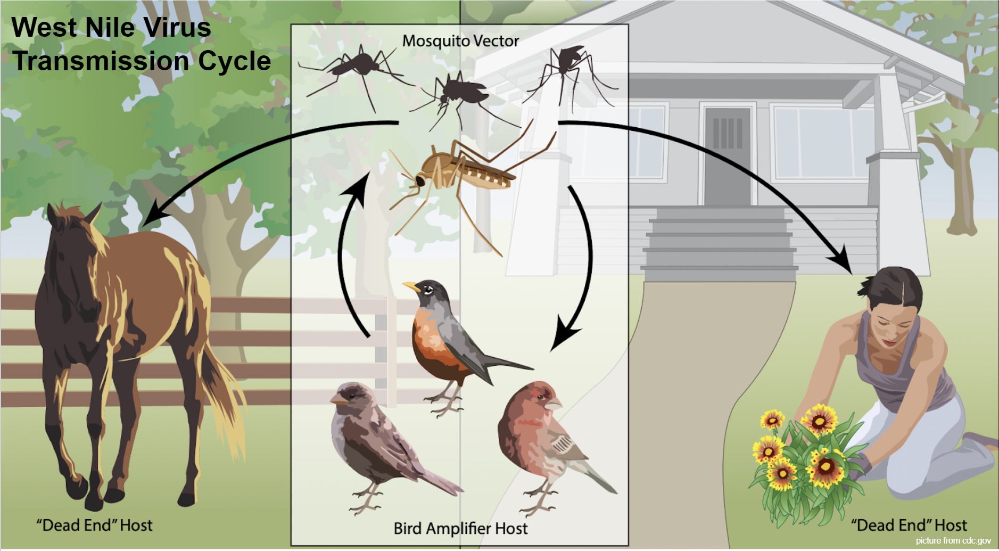

#  

# Project 4: West Nile Virus Prediction

# Background

**What is West Nile Virus**
West Nile Virus (WNV) is the leading cause of mosquito-borne disease in the continental United States.  It is most commonly spread to people by the bite of an infected mosquito. Cases of WNV occur during mosquito season, which starts in the summer and continues through fall. There are no vaccines to prevent or medications to treat WNV in people. Fortunately, most people infected with WNV do not feel sick. About 1 in 5 people who are infected develop a fever and other symptoms. About 1 out of 150 infected people develop a serious, sometimes fatal, illness. You can reduce your risk of WNV by using insect repellent and wearing long-sleeved shirts and long pants to prevent mosquito bites.

**West Nile Virus in Chicago**

CHICAGO – The Chicago Department of Public Health (CDPH) is reporting 6 cases of West Nile virus infection this year among Chicago residents, following CDC confirmatory testing performed for the first case. All patients developed symptoms between August 15-September 5 and were hospitalized. No deaths have been reported. The age range is 43-75 years (median 57), 3 are female, and 4 are White and 2 are Hispanic. One individual reports traveling out of state during their potential exposure period. The individuals reside in the North, West and East regions of the City. For the 2019 season, CDPH reported 6 human cases, including 1 death.
West Nile virus is transmitted through the bite of a Culex pipiens mosquito, commonly called a house mosquito, which has picked up the virus by feeding on an infected bird. Common symptoms include fever, nausea, headache and muscle aches. Symptoms may last from a few days to a few weeks. However, four out of five people infected with West Nile virus will not show any symptoms. In rare cases, severe illness including meningitis, or even death, can occur. People older than 60 and individuals with weakened immune systems are at higher risk for severe illness from West Nile virus and need to remain vigilant.
Each year CDPH conducts a comprehensive mosquito surveillance program, which includes placing larvicide in catch basins to limit the number of mosquitoes that can carry the virus, and trapping mosquitoes throughout the city and testing them for West Nile virus. By using data, the City is able to most efficiently target high-risk areas for the virus and keep residents safe.

# Problem Statement

Predict **when** and **where** different species of mosquitoes will test positive for West Nile virus. A more accurate method of predicting outbreaks of West Nile virus in mosquitoes will help the City of Chicago and CPHD more efficiently and effectively allocate resources towards preventing transmission of this potentially deadly virus.

# Result and Discussion

| Model | Features | PCA | nummosquitos/Regressor | Classification Model | Validating Roc_auc Score | Kaggle Score |
|-|-|-|-|-|-|-|
| 0 | All | Yes | No/- | RandomForestClassifier | 0.6212 | 0.5829 |
| 1.1 | All | Yes | Yes/RandomForest | GradientBoostingClassifier | 0.8262 | 0.4996 |
| 1.2 | All | No | Yes/RandomForest | GradientBoostingClassifier | 0.8728 | 0.4709 |
| 2 | Species,Date,Location | No | Yes/RandomForest | GradientBoostingClassifier | 0.8897 | 0.7554 |
| 3 | Species,Date,Location + AverageTemp,Dewpoint | No | Yes/RandomForest | GradientBoostingClassifier | 0.8876 | 0.7669 |
| 4* | Species,Date,Location + AverageTemp,Dewpoint | No | Yes/RandomForest | GradientBoostingClassifier (tuning hyper parameter) | 0.8902 | 0.7151 |

**Discussion**

4 Models were built in this project and the model which performs best in kaggle competition is model 3 which is based on model 2. The features used in model 3 consist of 

- `Species` -> treated as a dummy variables
- `Dates` -> week and year
- `Location` -> latitude,longitude
- `Weather Data` -> Average temperature and Dew point temperature

The idea behind model 1 is that all the features should be included and the weather data from $t_{-1}$ and $t_{-2}$ are also added to the main dataset,however, result showed that the score is much lower than the small subset of features in model 2 and 3. This could be caused by the fact that West Nile Virus is a seasonal virus and all the weather data can be neglected since there are also temporal features in the main datasets. From EDA, we can see that all the years (2009-2013), temperatures shows the cycle of seasonal trends and did not change much even from the global warming. Thus, when many features are used and most of them cannot make any impact on predicting the presence of virus, the model becomes inaccurate. 

Moreover, the weather-related features we got is only from `station1` and `station2` which is not exclusive to each traps thus could lower the accuracy. Surprsingly,`week` can be effectively infered to local weather data due to weather's seasonality.

**Improvement**

To improve roc auc score, the following features could be explore:

- Moving average of weather features
- Iterate through weather datasets to see that weather from 'x' days ago can impact the presence of virus
- Spray impact that might be left io the traps exposed by the chemical

# Conclusion and Recommendation

**Conclusion:**

The best features that can be used for predicting mosquito infected by West Nile Virus are

1. Week Number - indicates the season and time of the year
2. Year - indicates the changes that happen in each year
3. Mosquito Species
4. Latitude and Longitude - approximate locations of where the virus was present
5. Tavg - Average temperature
6. Dewpoint - Temperature to which air must be cooled to become saturated with water vapor.

Our model also yields a high accuracy score of 89%, with low misclassification score of about 11%.
Since the aim of doing this project is to reduce the chance of people being infected by mosquito that carry the West Nile Virus, we should be focusing on reducing the False Negatives. In doing so, we would predict that virus is present even though it might not be present, in other words, increasing False Positives.

In trying to reduce False Negatives, this would mean that an increase in spraying would be needed even though it might not be necessary, thus increase the cost of the city.
By spraying these pesticides, people would be advised to stay home, meaning they would have to know about the spray taking place. This could also lead to unnecessary panic amongst the people in the area. Therefore, proper educating system needs to be put in place so there is no chaos created.

**Evaluation:**

The West Nile Virus might not only be occurring in one place, but with the weather data of only location, our model is not generalized enough. As of January 5th, 2020, 44 states have reported infections. https://www.cdc.gov/westnile/statsmaps/preliminarymapsdata2020/index.html

The features that proved to be effective enough for Chicago (our data), might not be indicative enough for presence of the virus in other parts of continent. Gathering information from all the states by setting up experiments would give a better sense of key indicators of when and where West Nile Virus might be present. However, this process could be costly.
Weather conditions in different states and in different times is also likely to be quite different.
As temperature of the world is also on the rise, taking it into account might also help form indicators of time of the year that would reach the average temperature for which the virus thrives.

**Project Management**
Our project were managed by using trello in the following link: https://trello.com/b/UcREmDgF/project-4

